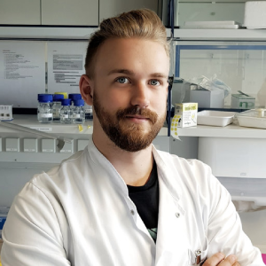

 

## Info

{: align=right }
Mike Marquet is a phD student at the *Institute for Infectious Diseases and Infection Control*. His area of expertise is metagenomes, phages, workflows, containerization and nanopore sequencing. 

## Links
[:octicons-mail-16: Email](mailto:mike.marquet@med.uni-jena.de)  
[:octicons-person-16: Researchgate](https://www.researchgate.net/profile/Mike_Marquet)  
[:octicons-mark-github-16: github link](https://github.com/mult1fractal)

